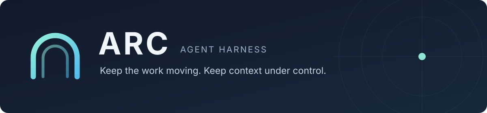

<p align="center">
  
</p>

<p align="center">An agent harness for coding and long-running work, with context you can control.</p>

<p align="center">
  <a href="https://github.com/dycalo/ARC/actions/workflows/ci.yml"></a>
  <a href="LICENSE"></a>
  
</p>

<p align="center">
  <a href="#get-started">Get started</a> ·
  <a href="docs/README.md">Documentation</a> ·
  <a href="docs/core.md">SDK</a> ·
  <a href="CONTRIBUTING.md">Contributing</a> ·
  <a href="README.zh-CN.md">中文</a>
</p>

ARC brings DeepSeek Harness's tools and browser interface together with a bounded working context, durable memory, and workspace-specific execution policies. Use it interactively, run tasks from your terminal, or embed its TypeScript runtime in your own agent.

The agent declares the evidence it needs next. The runtime selects and verifies each View within its context budget, using labelled previews where permitted. Original evidence remains available in the archive; memory checkpoints are optional.

During native work, ARC gives current tool results priority over old optional material and can retain recent progress as source-dependent model memory. Use `last:read` or `last:bash` in requirements to request an earlier result without copying its record identifier. These references describe recorded observations; they do not establish that a file or test outcome is still current.

A bounded activity record tracks recent native operations from the execution journal, even when optional progress memory expires. Its size is controlled by the host and counts toward the same context limit.

Custom hosts can select `viewFormat: text` to show native source code and test output with their original newlines. See [context and memory settings](docs/configuration.md#context-and-memory) for its exact input limits and retention behavior.

Custom integrations can select a [readable View format](docs/configuration.md#context-and-memory) and configure bounded recovery for unattended tasks that stop before completion. Context-mode native tools keep their DSH permissions; the contract's managed-action list describes ARC database operations.

## Get started

Requires Node.js **22.19+**, npm, and a model provider credential. Build and install from source:

```sh
git clone https://github.com/dycalo/ARC.git
cd ARC
npm ci
npm pack
npm install --global ./dycalo-arc-0.1.0.tgz
```

In the project you want to work on:

```sh
arc setup
export DEEPSEEK_API_KEY="your-api-key"
arc web
```

`setup` installs a private, versioned runtime and configures ARC for the current workspace. `web` starts the interactive harness. You can also configure your provider in the browser's model settings.

Open **ARC workspace** in the sidebar to see your context budget, recent View usage, active contract, and pending contract proposals. The same overview is available under **Settings → ARC**.

To run a task directly from the terminal:

```sh
arc exec "Inspect this project and write an onboarding guide to ONBOARDING.md"
```

See the [harness guide](docs/harness.md) for setup, storage, modes, and troubleshooting.

## Built for sustained work

- **Work in your project.** Use DSH's native tools in the default context mode, with the same workspace in the browser and terminal.
- **Keep context bounded.** ARC replaces the model's working View under a configurable byte budget while retaining the underlying session history.
- **Carry useful memory forward.** Store and retrieve task memory with source versions and expiry. Updated evidence invalidates memories that depend on it.
- **Plan beyond the next call.** Choose requirement lifetimes and refresh policies for a single step, a window of steps, or a task.
- **Control managed actions.** Run workflows under versioned rules and review model-proposed contract changes before applying them.

## Choose an execution mode

| Mode | Use it for | Execution |
| --- | --- | --- |
| **Context** — default | Coding, exploration, and work with DSH tools | Native tools use DSH's execution policies; ARC manages the working context. |
| **Governed** | Workflows over ARC-managed state | ARC validates and commits its SQLite actions under the active contract. |

Select governed mode when setting up a workspace:

```sh
arc setup --mode governed
```

The saved mode is used for subsequent launches. File, shell, and external tool effects do not acquire SQLite transaction semantics. See [execution policies](docs/assurance.md) for the supported guarantees.

## Make it yours

```sh
arc setup --view-budget 32768 --horizon 6 --refresh adaptive
```

Settings are saved for subsequent launches. Use `arc setup --context-config arc.context.json` for memory capture, text Views, optional native declarations and request limits. Optional [bounded native conversation](docs/configuration.md#bounded-native-conversation) retains complete recent tool turns with admitted native output in the matching tool messages, under the same input limits. Start from the [coding configuration example](examples/context-coding.json); see [configuration](docs/configuration.md#import-context-settings) for precedence and recovery options. `arc harness status` shows the saved policy.

New installations execute native tools together with next-step evidence requirements. ARC selects the next View; the agent does not need to write checkpoints. To migrate an existing context workspace, run `arc setup --native-mode declarative --checkpoint-every 0`. See [native actions and recovery](docs/native-execution.md). For individual native tools such as `arc_bash`, select `--native-mode declarative-tools`; their original arguments gain an `arc_requirements` field. Up to 16 native calls can share one response and execute in order under one plan; managed `arc_act` is submitted separately. The runtime budgets both rendered evidence and its JSON-string encoding before dispatch.

| Need | Start here |
| --- | --- |
| Run and configure the harness | [Harness guide](docs/harness.md) |
| Set context budgets, memory limits, and refresh policies | [Configuration](docs/configuration.md) |
| Understand initial rules and model-proposed changes | [Contracts](docs/contracts.md) |
| Add ARC to an existing DSH installation | [DSH integration](docs/dsh.md) |
| Build an agent on the TypeScript runtime | [Core SDK](docs/core.md) |
| Use the lightweight standalone runner | [Standalone CLI](docs/cli.md) |
| Understand the runtime and execution model | [Architecture](docs/architecture.md) |

## Contribute

Development checks require Node.js 22.19+ and Python 3. Python is used only for grader regression tests.

```sh
npm ci
npm run check
```

Read [CONTRIBUTING.md](CONTRIBUTING.md) for the development workflow and [open an issue](https://github.com/dycalo/ARC/issues) for reproducible bugs or focused feature proposals.

For repeatable harness checks and optional spending controls, see [evaluation tooling](docs/evaluation.md).

For existing installations, follow the [migration notes](CHANGELOG.md#migration-from-earlier-repository-builds).

Licensed under [Apache-2.0](LICENSE). Built with [DeepSeek Harness](https://github.com/deepseek-ai/deepseek-harness); ARC is an independent project.
