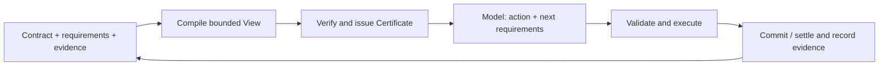

<p align="center">
  
</p>

<p align="center"><strong>Bounded context. Explicit evidence. Verified commits.</strong></p>

<p align="center">
  <a href="https://github.com/dycalo/ARC/actions/workflows/ci.yml"></a>
  <a href="LICENSE"></a>
  
</p>

<p align="center">
  <a href="#get-started">Get started</a> ·
  <a href="docs/README.md">Documentation</a> ·
  <a href="docs/core.md">SDK</a> ·
  <a href="docs/assurance.md">Guarantees</a> ·
  <a href="README.zh-CN.md">中文</a>
</p>

ARC is an agent harness for long-running work, with a Web UI, a terminal launcher, and an independent TypeScript runtime. Built on DeepSeek Harness's tools and interaction model, ARC organizes working context into a bounded **View** and verifies evidence coverage and bindings through **Contracts, requirements, and Certificates**.

The model declares what it needs; the runtime owns selection, budgets, and verification. Original evidence stays in the archive while each call receives admitted working context. Use ARC for tasks that carry observations, identifiers, and obligations across many steps.

## What ARC brings

- **Bounded Views.** Exact rendered UTF-8 byte accounting, with a separate request limit. Mandatory evidence that cannot fit causes an explicit refusal.
- **Evidence coverage and certificates.** Check active requirements, sources, versions, and representations. Every model invocation gets a fresh Certificate.
- **Durable memory and requirement windows.** Keep source-bound memory with expiry, and declare evidence needs for a step, several steps, or a session.
- **Verified managed commits.** Validate and apply managed actions, consume proposals, and activate subsequent requirements in one SQLite transaction.
- **A familiar workspace.** Web and terminal share workspace state; the independent core also embeds in your own agent.

## Get started

Requires Node.js **22.19+** and npm. Build and install the current v0.1 from source:

```sh
git clone https://github.com/dycalo/ARC.git
cd ARC
npm ci
npm pack
npm install --global ./dycalo-arc-0.1.0.tgz
```

Try the deterministic runtime demo without an API key:

```sh
arc demo
```

It runs three managed-state transitions with three distinct Certificates in a temporary store, then cleans up.

Next, enter the project you want to work on and launch the full harness:

```sh
arc setup
export DEEPSEEK_API_KEY="your-api-key"
arc web
```

`setup` installs a private, pinned DSH toolchain; `web` starts the browser interface. Provider credentials can also be configured in the browser settings. Real model calls use your provider account and may incur charges.

Open **ARC workspace** in the sidebar to inspect the View budget, recent usage, active Contract, and pending changes. The same overview is available under **Settings → ARC**.

Run a task from the terminal:

```sh
arc exec "Inspect this project and write an onboarding guide to ONBOARDING.md"
```

See the [harness guide](docs/harness.md) for installation, storage, updates, and troubleshooting.

## How it works



Verification is relative to the configured Contract and active requirements: evidence sources, versions, representations, and invocation bindings. It does not guarantee complete model declarations, correct reasoning, or task success. Managed transactions and external-tool settlement have different boundaries:

| Mode | Use it for | Execution boundary |
| --- | --- | --- |
| **Context** — default | Coding, exploration, and DSH tool tasks | ARC admits evidence and journals declarative tool execution. Files, shell, and external tools follow DSH policies; their effects are outside the SQLite transaction. |
| **Governed** | Workflows over ARC-managed state | ARC validates and atomically commits SQLite-managed actions under the active Contract. |

The model can propose Contract changes for the host to review and apply. Model memory cannot overwrite host evidence or weaken contract obligations. See [guarantees](docs/assurance.md) and [contracts](docs/contracts.md).

## Configure your working context

```sh
arc setup --view-budget 32768 --horizon 6 --refresh adaptive
arc harness status
```

The View budget is a peak byte limit; the horizon configures a multi-step window. Each model call still needs fresh admission and a Certificate. Whole-request, output-token, and spending limits are separate. Settings persist across launches.

For a complete coding profile, save [context-coding.json](examples/context-coding.json) as `arc.context.json` in your project, then import it:

```sh
arc setup --context-config arc.context.json
```

This profile selects a 256 KiB View ceiling, text rendering, and up to eight admitted native interaction groups. An [unattended profile](examples/context-unattended.json) also enables bounded continuation. Select governed mode with `arc setup --mode governed`.

## Documentation and status

| Need | Guide |
| --- | --- |
| Install, launch, and update | [Harness](docs/harness.md) |
| Configure budgets, memory, and windows | [Configuration](docs/configuration.md) |
| Understand Contracts and proposal review | [Contracts](docs/contracts.md) |
| Embed the TypeScript runtime | [Core SDK](docs/core.md) |
| Add ARC to an existing DSH installation | [DSH integration](docs/dsh.md) |
| Understand commits and recovery | [Native execution](docs/native-execution.md) · [Guarantees](docs/assurance.md) |

**v0.1, installed from source.** The integration targets pinned DSH `0.1.2-rc.1`; the core is independent of DSH. CI covers tests, installation and soak checks on Node 22/24, plus official DSH integration on Node 22. See the [changelog](CHANGELOG.md) for upgrades and the [release guide](docs/release.md) for validation scope.

## Contribute

Development checks also require Python 3 for grader regression tests. Ordinary harness use does not require Python.

```sh
npm ci
npm run check
```

Read [CONTRIBUTING.md](CONTRIBUTING.md) and [open an issue](https://github.com/dycalo/ARC/issues) with reproducible bugs or focused feature proposals.

Licensed under [Apache-2.0](LICENSE). Built with [DeepSeek Harness](https://github.com/deepseek-ai/deepseek-harness); ARC is an independent project.
