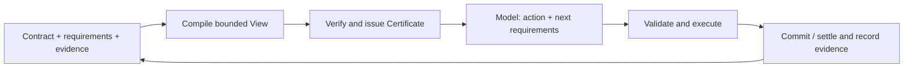

<p align="center">
  
</p>

<p align="center"><strong>有界上下文，明确的证据，经过验证的提交。</strong></p>

<p align="center">
  <a href="https://github.com/dycalo/ARC/actions/workflows/ci.yml"></a>
  <a href="LICENSE"></a>
  
</p>

<p align="center">
  <a href="#开始使用">开始使用</a> ·
  <a href="docs/README.md">文档</a> ·
  <a href="docs/core.md">SDK</a> ·
  <a href="docs/assurance.md">保障边界</a> ·
  <a href="README.md">English</a>
</p>

ARC 是面向长程工作的 Agent harness，提供 Web 界面、终端入口和独立的 TypeScript runtime。它基于 DeepSeek Harness 的工具与交互能力，用受预算约束的 **View** 组织模型工作上下文，并通过 **Contract、requirements 和 Certificate** 验证证据覆盖与绑定。

模型声明需要什么，runtime 负责选择、预算和验证。原始证据保留在存储中，每次调用只接收通过准入的工作上下文。适合需要跨越多步保留观测、标识符和约束的任务。

## ARC 提供什么

- **有界 View。** 精确计量渲染后的 UTF-8 字节，另行限制整体请求。必要证据装不下时明确拒绝。
- **证据覆盖与证书。** 检查有效需求、来源、版本和表示要求；每次模型调用都签发新 Certificate。
- **持久记忆与需求窗口。** 记忆携带来源和有效期，需求可持续一步、多步或整个任务。
- **经过验证的受管提交。** 在同一 SQLite 事务内检查并应用受管动作、消费 proposal、激活后续 requirements。
- **熟悉的工作入口。** Web 和终端共享工作区；也可以将独立 core 嵌入自己的 Agent。

## 开始使用

需要 Node.js **22.19+** 和 npm。当前 v0.1 从源码构建安装：

```sh
git clone https://github.com/dycalo/ARC.git
cd ARC
npm ci
npm pack
npm install --global ./dycalo-arc-0.1.0.tgz
```

先体验无需 API key 的确定性 runtime demo：

```sh
arc demo
```

它在临时存储中执行三次受管状态转换，并生成三个不同的 Certificate；完成后清理存储。

然后进入你要工作的项目目录，启动完整 harness：

```sh
arc setup
export DEEPSEEK_API_KEY="your-api-key"
arc web
```

`setup` 安装固定版本的独立 DSH 运行环境，`web` 启动浏览器界面。模型服务凭据也可在浏览器设置中配置，真实模型调用按服务商规则计费。

打开侧边栏的 **ARC 工作区**，可查看 View 预算、最近用量、有效 Contract 和待审修改提案。概览也位于 **设置 → ARC**。

从终端执行任务：

```sh
arc exec "Inspect this project and write an onboarding guide to ONBOARDING.md"
```

安装、存储、更新和故障处理见 [Harness 指南](docs/harness.md)。

## 执行流程



验证相对于已定义的 Contract 和有效 requirements，覆盖证据来源、版本、表示与调用绑定。它不保证模型声明完备、推理正确或任务成功。受管动作事务与外部工具结算的边界如下。

| 模式 | 适用场景 | 执行边界 |
| --- | --- | --- |
| **Context**，默认 | 编码、项目探索、DSH 工具任务 | ARC 管理证据准入并记录声明式工具执行；文件、shell 和外部工具遵循 DSH 策略，副作用不属于 SQLite 事务。 |
| **Governed** | ARC 受管状态上的工作流 | ARC 在有效 Contract 下验证并原子提交 SQLite 受管动作。 |

模型可提出 Contract 修改候选，由宿主审核并应用。模型记忆不能覆盖宿主证据或削弱契约义务。详见[保障边界](docs/assurance.md)与[契约指南](docs/contracts.md)。

## 配置你的工作上下文

```sh
arc setup --view-budget 32768 --horizon 6 --refresh adaptive
arc harness status
```

View budget 是字节计量的峰值上限，horizon 配置多步窗口；每次模型调用仍需新的准入与 Certificate。整体请求、输出 token 和费用限制分别配置。设置会保存到后续启动。

需要完整编码配置时，将 [context-coding.json](examples/context-coding.json) 保存为项目中的 `arc.context.json`，然后导入：

```sh
arc setup --context-config arc.context.json
```

该配置采用 256 KiB View 上限、文本呈现和至多八组已准入的原生交互。另有带有限继续执行能力的[无人值守配置](examples/context-unattended.json)。选择 governed 模式使用 `arc setup --mode governed`。

## 文档与项目状态

| 需要做什么 | 文档 |
| --- | --- |
| 安装、启动与更新 | [Harness](docs/harness.md) |
| 配置预算、记忆与窗口 | [Configuration](docs/configuration.md) |
| 理解 Contract 和提案审核 | [Contracts](docs/contracts.md) |
| 嵌入 TypeScript runtime | [Core SDK](docs/core.md) |
| 接入现有 DSH | [DSH integration](docs/dsh.md) |
| 了解提交与恢复边界 | [Native execution](docs/native-execution.md) · [Guarantees](docs/assurance.md) |

**v0.1，源码安装。** 支持固定版本 DSH `0.1.2-rc.1`，core 独立于 DSH。CI 覆盖 Node 22/24 下的测试、安装与持续运行检查，以及 Node 22 下的官方 DSH 集成。升级见 [Changelog](CHANGELOG.md)，验证范围见[发布指南](docs/release.md)。

## 参与开发

开发检查另需 Python 3，用于评分器回归测试；日常 harness 使用无需 Python。

```sh
npm ci
npm run check
```

欢迎提交可复现的 [问题报告](https://github.com/dycalo/ARC/issues) 或明确的功能建议。开发流程见 [CONTRIBUTING.md](CONTRIBUTING.md)。

采用 [Apache-2.0](LICENSE) 许可。基于 [DeepSeek Harness](https://github.com/deepseek-ai/deepseek-harness) 构建，ARC 是独立项目。
