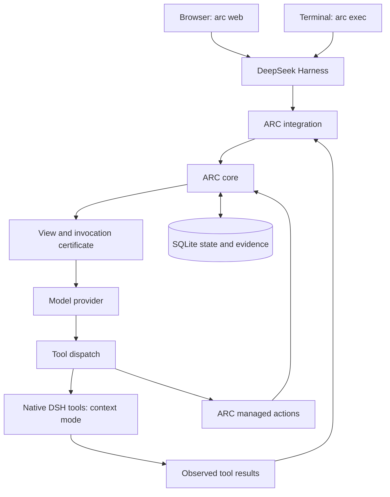

# Architecture

ARC is one npm package with three layers: a workspace launcher, a DeepSeek Harness plugin, and an independent TypeScript runtime. The launcher provides `arc web` and `arc exec`; the plugin integrates context admission into DSH's agent loop; the runtime owns requirements, Views, memory, contracts, and managed state.

## The working context

DSH retains the session event log. Before each actor call, ARC admits new user input, runtime context, and tool observations into its evidence store. The runtime combines these inputs with contract obligations, active requirements, and eligible memory to construct a View. That View replaces the historical model-visible surface.

The View has an exact UTF-8 byte budget. Required evidence that cannot fit stops admission with an error. The integration separately checks the assembled provider request, which also contains system instructions and tool schemas. Provider token accounting remains separate from both byte limits.

Requirement windows control how long declarations live and when candidate selection refreshes. They allow planning for several future calls. Each call still admits current evidence and receives a new invocation certificate. Updating a source invalidates dependent memory and outstanding decisions that relied on its old version.

## Execution and persistence

Context mode retains native DSH tools for project work. Their output becomes evidence for later calls; their external effects follow DSH's own policies. Governed mode exposes only ARC's managed actions.

For a managed action, the runtime validates a single-use proposal against its invocation, contract, and current dependency versions. Applying the action, consuming the proposal, and activating the next requirements share one SQLite transaction. This boundary covers ARC's database operations. File writes, shell commands, and remote services need their own execution and recovery design.

The DSH home stores browser configuration and session history. The workspace's `.arc` directory stores ARC state and a nonsecret installation pointer. The launcher uses a private DSH home for each canonical workspace and restricts its profiles to that workspace's session directory. This is session routing, not an operating-system sandbox.

## Module boundaries

| Layer | Source | Responsibility |
| --- | --- | --- |
| Core SDK | `packages/core/src` | Pure runtime interface, evidence admission, contract lifecycle, SQLite state transitions |
| DSH plugin | `packages/dsh/src` | Session adaptation, input replacement, request checks, tool registration and guards |
| CLI | `packages/cli/src` | Installation, process launch, diagnostics, and the optional standalone provider loop |

Core does not import DSH. An embedding host can import `@dycalo/arc` and use `ArcRuntime` directly. Existing DSH installations can import `@dycalo/arc/dsh` without using the workspace launcher. See the [SDK](core.md), [DSH integration](dsh.md), and [runtime guarantees](assurance.md) for the exact interfaces and limits.
