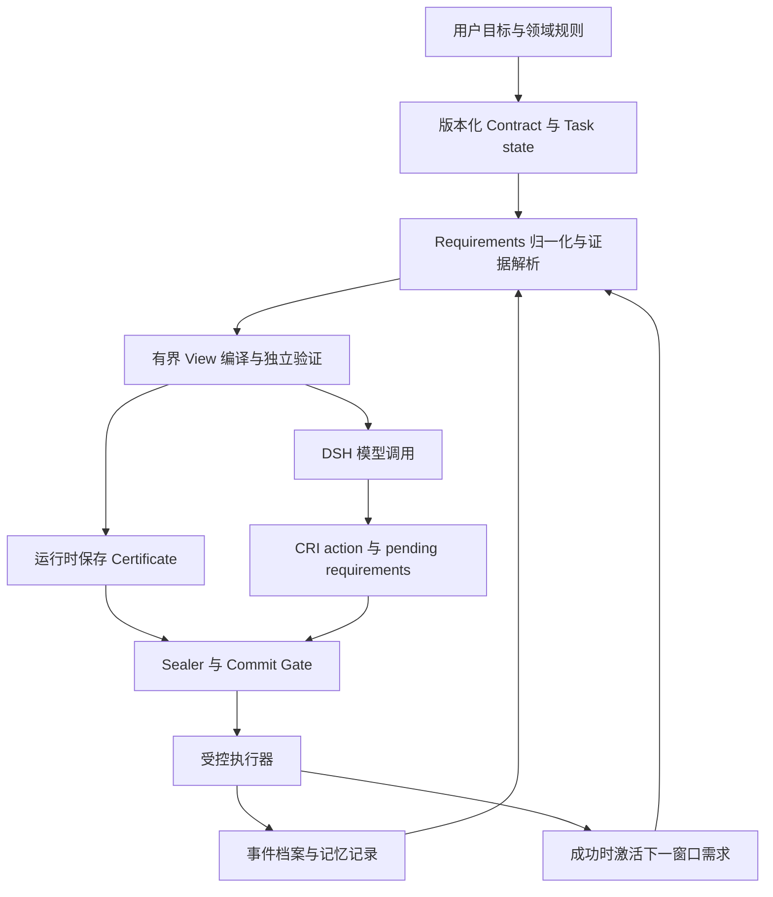

ARC 基于 DSH 工程化的可行性研判

核查日期：2026-09-06。论文依据为当前目录的 [ARC_full_paper.tex](../ARC_full_paper.tex)。DSH 依据为官方仓库提交 `d347e703908d0406b7a7ef80e3a0e594d86b2215`，其根包版本为 `0.1.3-alpha.1`。本文区分源码事实、论文保证与产品设计建议；没有运行 DSH、调用模型或复现论文实验。当前目录只有论文材料，没有论文所述 Python/LangGraph 实现，尚不能判断既有代码可复用程度。

**结论：技术上可行，适合用 DSH 做首个产品载体。建议建设独立 ARC 核心与 DSH 插件组合，先验证文本及受控工具场景。** 当前证据不支持一开始就大规模 fork DSH，也不支持直接把所有通用 Agent 动作纳入论文的完整保证。DSH 官方仍将产品标为 developer preview，明确允许破坏兼容性的变化，因此应固定版本、隔离适配层。[官方说明](https://github.com/deepseek-ai/deepseek-harness/blob/d347e703908d0406b7a7ef80e3a0e594d86b2215/README.md)

论文已经提供两个自然的产品落点：ARC-CRI 面向通用软件/终端任务，提供前瞻需求驱动的上下文物化；完整 ARC 面向具有可执行契约、版本化资源与原子条件执行器的领域。公共基准使用的是前者，其结果支持资源节省的可行性，但不能当作完整安全保证或成功率全面领先的证据。见论文第 837、858–874、1052–1078 行。

DSH 的接入条件及证据如下，详细源码定位见 [DSH 源码调研](dsh-source-feasibility-2026-09-06.md)。

| ARC 需要的能力 | 已核查的 DSH 机制 | 工程判断 |
| --- | --- | --- |
| View 替换历史 | Session 的持久日志与模型消息 surface 分离；`surfaceOp: replace` 可以遮蔽旧消息，`deriveMessages()` 使用替换后的投影 | 能真正替换模型历史，不必删除审计记录 |
| 控制下次输入 | `agent/pre-step` 可处理本步入队消息；已有历史仍由 Session 投影 | 仅返回一个 View 或调用 `agent.inject()` 不够，必须同时管理 surface |
| 记录完整请求 | `request/header` 保存 system、工具 schemas 和调用配置；消息来自 Session | 适合复现与审计，但 ARC 需覆盖所有动态输入来源 |
| 在请求出口验证 | `llm/stream` 可观察请求；loop 请求冻结，不能当作随意改写消息的接口 | 可设计末端验证器；发现不一致应拒绝调用，而非默默补一段提示词 |
| CRI 输出 | 原生 tool call 有固定字段，可注册自定义工具和参数 schema | 用 ARC 自有 envelope 或工具包装承载 action、requirements、额外依赖 |
| 动作前阻断 | `tools/pre-execute` 支持策略判断；`ctx.tools.guard()` 在其后提供单调同步拒绝 | 可实施前置检查；原子提交须由受控执行器完成 |
| 配置/发行组合 | Cordis 插件、profile、bundle、patch 支持替换能力及配置 | 首版优先固定 DSH 版本并发行 ARC 配置组合 |
| 持久化扩展 | 自定义事件可扩展类型，但默认持久化读取使用构建生成的已知事件集合 | 关键 ARC 状态需自有 durable store，或定制持久化/构建；不能把关键状态标为可忽略来绕开恢复问题 |

这些判断依据 [Session 实现说明](https://github.com/deepseek-ai/deepseek-harness/blob/d347e703908d0406b7a7ef80e3a0e594d86b2215/packages/core/session/README.md)、[架构与调用顺序](https://github.com/deepseek-ai/deepseek-harness/blob/d347e703908d0406b7a7ef80e3a0e594d86b2215/docs/architecture.md)、[工具执行机制](https://github.com/deepseek-ai/deepseek-harness/blob/d347e703908d0406b7a7ef80e3a0e594d86b2215/packages/core/tools/README.md) 与源码调研中列出的持久化实现。

**next-k-step 应拆为三个独立配置。** 论文的 Certificate 绑定特定 invocation、snapshot、contract version 与精确 View 渲染，原协议每轮最多一次模型调用及一次副作用。因此不能把“每步重建”机械地改成“每 k 步才做全部校验”。见论文第 688–740、751–770 行。

| 配置维度 | 可调整部分 | 保留完整 ARC 保证时的要求 |
| --- | --- | --- |
| 需求声明跨度 | next-1、next-k、面向阶段/子目标的需求计划 | 自报需求不能删掉契约义务与运行时推导的依赖 |
| 检索与 View 重建频率 | 每步、固定窗口、事件驱动、增量更新 | 每次实际模型调用仍有对应其当前输入的准入验证和新调用绑定 |
| 执行检查频率 | 可按工具治理等级选择适用范围 | 每个受控副作用均检查证书、依赖版本、实时前置条件及提案状态 |

建议采用“最大 k 步 + 提前失效事件”的窗口。这里的 step 先明确定义为一次 actor 模型调用；一轮产生多个工具动作时，动作分别计数、分别治理。将 `k=4` 或 `k=8` 作为对比实验参数，而非未经测量的生产默认值。

窗口可缓存候选证据、需求计划和仍有效的检查结果；每次调用只物化当下需要的有界 View，并针对本次输入签发/绑定证书。不要把未来 k 步全部原始材料强行塞进同一个 View。环境变化、工具发现新依赖、用户修改目标、契约升级、预算不足或 guard 拒绝，均可提前结束窗口。Agent 自己写入文件也会改变相关资源版本，下一次决策需要采用新状态；这不是异常情形。

若在窗口内保留短期工具轨迹，这段轨迹也必须纳入本次 View 的来源、版本与预算计算。形式上可以写成 `V_t = admitted working set + admitted local observations`，但新增观察意味着本次输入不同，旧证书不能自动覆盖它。论文证明需对新增的窗口状态转换做对应扩展或归约，不能仅以配置开关声称继承。

**记忆应成为 View 的数据来源；contract 的修改应成为受治理的状态转换。** 模型维护记忆有价值，但以下对象不宜混为同一份可随意改写的 Markdown：

| 对象 | 例子 | 建议所有权与更新方式 |
| --- | --- | --- |
| Domain Contract | 决策证据义务、依赖推导规则、写入前置条件 | 运行时保护并版本化；模型只能提出 patch，由已授权规则决定能否生效 |
| Task state / requirements | 当前阶段、验收项、下一窗口需求、未解决阻塞 | 模型提议更新，运行时校验作用域、冲突和状态迁移 |
| 事实及经验记忆 | 之前读到的接口、试验结果、失败原因、用户偏好 | 允许追加和修订候选记录，携带来源、适用范围、版本或失效条件 |
| 当前 View | 本次决策可见的必要证据与相关记忆 | 编译器按预算选择，独立 verifier 决定是否准入 |

模型生成 contract patch 后，先验证格式、修改权限、规则一致性及依据，再由运行时发布新版本；旧证书失效，后续重新决策。不必让用户确认每条普通记忆，但模型不能自行删除外部授予的约束。自然语言规则可作为建议或软检查；要作为完整 ARC 的强制义务，须有适用范围明确、可独立执行的 predicate。论文将 contract registry、normalizer、verifier、sealer 与 gate 列为可信部分，模型和 compiler 不在其中。见第 773–774、1191–1211 行。

requirements 漏报不能只靠 Certificate 解决。论文已合并 declared、inferred、observed 与 global 四路信号；如果某需求既未被这四路发现，也未写入 Domain Contract，证书不会证明它不存在。模型建议、静态资源依赖分析、实际访问记录与领域规则应共同补足需求。见第 827–836 行。

记忆条目的初始字段可包括 `id / kind / scope / provenance / resource_versions / status / valid_until`。摘要有来源不等于摘要忠实；对必须完整呈现的证据，应验证对应义务，失败时回到原始记录。失效记忆不能被当作当前资源状态；若要使用“过去发生过什么”，须按明确的历史查询或不可变事件语义建模并验证适用性。仍携带旧资源版本依赖的记录，不能仅加 historical 标签就绕过论文的快照一致性要求；未完成该适配的旧事实只留档，不进入严格模式的当前 View。DSH 提供第三方 memory MCP 接入示例，这只能复用存储/检索接入，不能替代 ARC 的来源、准入与失效协议。[官方 memory 接入说明](https://github.com/deepseek-ai/deepseek-harness/blob/d347e703908d0406b7a7ef80e3a0e594d86b2215/docs/user/guide/mcp-memory.md)

论文规定 global requirements 持续存在，缺少产品层面的退役策略。建议增加 task/window/session 作用域、可选条目的 TTL、显式 retire 与阶段迁移。只有具有相应权限的状态转换才能撤销硬约束；预算压力不能自动把 mandatory 改成 optional。强制证据无法装入预算时，提供缺项和冲突诊断、拆分任务或明确失败，避免无限重试。见第 835、841 行。

**产品结构可以保持较小。** 先把逻辑能力放在一个独立核心包和一个 DSH 适配包中；下图表示职责，不意味着第一版要部署多个微服务。

ARC 核心负责 schema、normalizer、record store、compiler/verifier、窗口状态机与 proposal 状态。DSH 适配层负责 surface replacement、system/tool 配置版本、最终请求审计、CRI 工具包装、事件关联及 session 生命周期。领域适配器定义资源版本、`O / Γ / Δ / P` 和执行器。若能提供论文原始 Python 实现，可以先评估核心复用或 sidecar；DSH 集成面以其原生 TypeScript 插件为宜。无论语言如何分配，不能把一次应原子的提交拆成几个没有协调协议的 RPC。

首版配置建议集中在 `profile`、`requirements.horizon`、`refresh.policy/max_steps/triggers`、`context.total_budget`、`memory.scope/retention`、`contract.update_policy`、`execution.coverage`。配置变化中会影响证据或动作语义的部分要进入版本和失效判断；先提供少量预设，再开放高级项。

推荐两个明确的预设语义：通用模式提供 CRI、记忆和上下文预算，按工具能力提供执行前检查；领域受控模式只允许已适配资源和动作，执行完整证书及提交协议。前者不应显示暗示“全部行动已被证明安全”的标签，后者遇到未适配动作不能悄悄降级后继续执行。

**真正需要先验证的风险是三个边界。**

1. 模型输入边界：surface 以外还有 system prompt、工具定义、运行时注入、子代理结果与 provider 变换。ARC 必须覆盖全部可变受管状态前提。`agent/request` 不允许修改 messages；`llm/stream` 对 loop 请求提供只读观察。因此建议先限文本、固定 adapter，测试 surface replacement + 受控 system/context composition + 末端验证。多模态、Code Mode、子代理和动态插件扩展逐项接入。具体限制见源码调研与 [LLM 服务](https://github.com/deepseek-ai/deepseek-harness/blob/d347e703908d0406b7a7ef80e3a0e594d86b2215/packages/llm/llm/src/index.ts)。
2. 执行边界：任意 shell 或外部 API 没有自动获得版本化和原子执行语义。文件 hash 检查后再执行 shell 仍存在状态变化窗口；幂等键、补偿、approval 也不等价于论文要求的原子条件提交。完整模式从一个可事务执行的结构化领域动作开始。`tools/post-execute` 即使屏蔽返回结果，也不能撤销已经发生的外部效果。论文第 770、1157 行明确限定这一点。
3. 恢复边界：DSH Session 日志适合审计，但不自动等同于 ARC 的版本化证据存储或事务账本。建议 ARC store 作为 contract/proposal/requirement 状态的权威来源，用 session ID、invocation ID、proposal ID 与 DSH 日志关联，DSH 侧只投影已提交结果。重启须对账、识别处理中状态并阻止提案重复执行。不能因为看到 assistant/message 或普通 tool success 事件就提前激活 requirements；对严格模式，以 ARC executor 已提交的权威状态为准。

**预算承诺应写成“单次输入有上限”，并分别管理存储与总开销。** 论文直接限制 `Cost(Render(V)) ≤ B`，并不限制 append-only 档案增长，也不保证长任务累计 tokens 恒定。产品预算还要包含 system、tool schemas、短期轨迹及输出预留。全量 View 替换会影响 provider 前缀缓存，较少输入 tokens 不必然对应同等比例的账单或延迟下降；DSH 自己也说明 replacement 会从被替换的位置使前缀复用失效。[Session 上下文与缓存行为](https://github.com/deepseek-ai/deepseek-harness/blob/d347e703908d0406b7a7ef80e3a0e594d86b2215/packages/core/session/README.md)

**建议用四个阶段推进，每阶段有可判定的结果。**

1. 做接入验证：固定当前 DSH，替换 model surface，捕获实际请求，接入一个结构化 ARC 动作和小型事务状态。验证 View 外无遗漏的可变状态输入、失败声明不激活、进程恢复不重复应用提案。这一阶段决定是否需要补充上游接口。
2. 做通用 Agent MVP：文本编码/分析任务，CRI + 事件档案 + 有界 View；先跑 k=1，再对比 k=4、k=8 与事件驱动窗口。不强行给任意 shell 添加完整保证。
3. 做一个领域受控闭环：选有现成领域知识且可控制执行器的场景，例如 CDI/IPO 风格的结构化流程或事务化配置更新；写真实 contract adapter，验证证据到提交的绑定。编码场景的文件补丁也可试点，但工作区、依赖及执行器范围必须明确，不能把整个开发环境视作一个已经原子化的资源。
4. 再扩展记忆和自治：增加模型提出 task/contract patch、记忆冲突与失效处理，随后覆盖子代理、Code Mode、MCP 和多模态。每扩展一种输入或执行入口，都验证其经过相同治理路径。

评估至少比较原生 DSH、ARC-CRI k=1、固定 k、事件驱动窗口，以及受控场景的完整 ARC。固定模型、任务与工具条件，统计任务完成率、遗漏或失效证据、无效动作拦截及有效动作保留、峰值实际输入、模型及辅助调用 tokens、缓存计费、端到端延迟、重建次数和重启恢复。加入外部改写、模型漏报、错误记忆、契约升级与中途崩溃案例。先用小样本决定接口与策略，再扩大任务数；不能以单次演示或论文内进程 gate 延迟作为生产验收。

在此范围内，DSH 的价值是复用 Agent 产品外围能力和明确的扩展点；ARC 的产品价值是让前瞻需求、记忆、模型可见证据与执行条件共享一套可检查的状态协议。当前最值得投入的是验证这套协议的输入、执行和恢复三个边界，而不是先堆积配置项或重写完整 harness。
